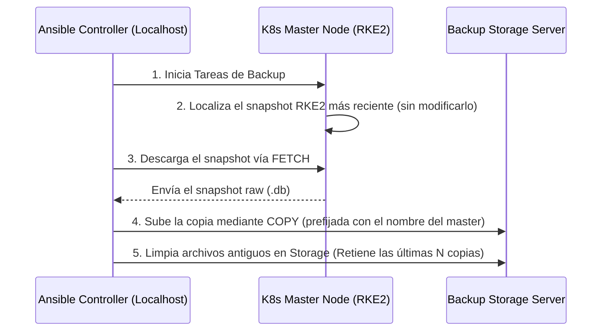

# Proyecto Ansible: Backup & Disaster Recovery de etcd para Kubernetes 🚀

Este proyecto implementa una arquitectura moderna, escalable y mantenible para la automatización de copias de seguridad consistentes de `etcd` (la base de datos y cerebro de tu clúster de Kubernetes) y provee un plan clínico y detallado para la recuperación ante desastres (DR).

---

## 🏛️ Arquitectura del Sistema

RKE2 ya genera de forma **nativa y automática** snapshots de `etcd` en cada control plane. Este proyecto **no crea snapshots**: simplemente toma el snapshot más reciente que RKE2 ya produjo en cada master y lo **copia tal cual (raw, sin comprimir)** hacia los servidores de backup, sin tocar ni eliminar el original gestionado por RKE2. La restauración posterior se realiza con cualquiera de esas copias.

Ofrece dos topologías de red según la conectividad de tu infraestructura.

### Flujo de Backup (Modo Mediado por Controlador)
En este modo (por defecto), los nodos master y de almacenamiento no requieren conexión directa entre sí, ya que el orquestador de Ansible actúa como puente seguro.



---

## ⚙️ Configuración y Estructura

El proyecto sigue las mejores prácticas de Ansible. Los archivos principales son:

- **`ansible.cfg`**: Configura optimizaciones como SSH Pipelining activo y desactivación de Host Key Checking.
- **`inventories/production/hosts.yml`**: Define tus nodos master (`control_planes`) y servidores de backup (`backup_servers`).
- **`inventories/production/group_vars/all.yml`**: Centraliza todas las variables de configuración.

### Variables Principales (`group_vars/all.yml`)
- `rke2_snapshot_dir`: Directorio donde RKE2 guarda sus snapshots automáticos (defecto: `/var/lib/rancher/rke2/server/db/snapshots`). Es el **origen** de las copias.
- `etcd_transfer_mode`: `"controller_mediated"` (recomendado para redes segmentadas) o `"direct_rsync"`.
- `etcd_backup_server_dir`: Directorio destino en los servidores de backup (defecto: `/srv/backup/kubernetes/etcd`).
- `etcd_backup_server_retention_count`: Cantidad de copias de etcd a retener en los servidores de backup por cada master (defecto: `3`).
  * *Nota: La retención en el origen (control planes) la gestiona el propio motor de RKE2 de forma automática.*

> Cada copia se guarda en el storage con el nombre del master como prefijo, p. ej. `k8s-master-01.infra.local-etcd-snapshot-k8s-master-01-1700000000`, para no colisionar entre control planes.

---

## 🚀 Guía de Uso

### 1. Ejecución Manual del Backup
Para forzar una copia inmediata (transferencia + retención) de todos los control planes:

```bash
ansible-playbook site.yml --tags backup_run
```

Tags disponibles:
- `backup_transfer`: solo copia el snapshot RKE2 más reciente al storage.
- `backup_prune`: solo aplica la política de retención en el storage.
- `backup_run`: ejecuta ambas (recomendado).

### 2. Configurar la Automatización Periódica (Cron en el Controlador)
La programación vive en el **controlador Ansible** (no en los masters). Se incluye un wrapper con logging y bloqueo anti-solapamiento en [`scripts/etcd-backup-cron.sh`](scripts/etcd-backup-cron.sh).

```bash
# En el controlador, como el usuario que posee las claves SSH:
crontab -e

# Ejemplo: cada 4 horas, en el minuto 0
0 */4 * * *  /ruta/al/repo/scripts/etcd-backup-cron.sh >> /var/log/etcd-backup.log 2>&1
```

Para validar la última ejecución:
```bash
tail -f /var/log/etcd-backup.log
```

---

## 🛡️ PLAN CLÍNICO DE RECUPERACIÓN ANTE DESASTRES (DR)

> [!WARNING]
> La restauración de `etcd` es una operación destructiva de alto riesgo. Detendrá temporalmente todo el plano de control del clúster de Kubernetes (`kube-apiserver`, `controller-manager`, `scheduler`). Ejecute estas acciones solo durante ventanas de mantenimiento o desastres declarados.

Ofrecemos dos alternativas para realizar la restauración: **Método Automatizado con Ansible** (Recomendado) y **Método Manual** (en caso de que la red o el orquestador estén caídos).

---

### Opción A: Restauración Automatizada (Recomendada) 🤖

El rol `etcd_restore` ejecuta el procedimiento oficial de RKE2 para clústeres HA: detiene `rke2-server` en todos los control planes, restaura el snapshot en un nodo primario con `rke2 server --cluster-reset`, lo reinicia y reincorpora al resto de masters borrando su `db/etcd`.

El sistema admite dos orígenes de backups (`etcd_restore_source`):
*   `backup_server` (Por defecto): Servidor de almacenamiento centralizado remoto.
*   `controller`: Directorio local en el host controlador de Ansible (por defecto en `backups/`).

Además, si no se provee un nombre de archivo, el playbook **identificará y restaurará automáticamente el snapshot más reciente**. El nodo primario es, por defecto, el primer host de `control_planes`; puedes cambiarlo con `-e "etcd_restore_primary=k8s-master-02.infra.local"`.

#### Paso 1: Ejecutar el Playbook de Restauración

> [!NOTE]
> Para evitar desastres accidentales, el playbook siempre requerirá que confirmes la palabra **`CONFIRMAR`** de forma interactiva.

Elige una de las siguientes formas de ejecución según tus necesidades:

##### Caso 1: Restaurar el snapshot más reciente desde el Storage Remoto (Recomendado)
```bash
ansible-playbook restore.yml
```

##### Caso 2: Restaurar un snapshot específico desde el Storage Remoto
```bash
ansible-playbook restore.yml -e "etcd_restore_file_path=k8s-master-01.infra.local-etcd-snapshot-k8s-master-01-1700000000"
```

##### Caso 3: Restaurar el snapshot más reciente ubicado en el host de Ansible (directorio local `backups/`)
```bash
ansible-playbook restore.yml -e "etcd_restore_source=controller"
```

##### Caso 4: Restaurar un snapshot local específico pasándole la ruta absoluta o relativa
```bash
ansible-playbook restore.yml -e "etcd_restore_source=controller etcd_restore_file_path=/mi/ruta/etcd-snapshot-xxxxxx"
```

---

#### ¿Qué hace el sistema de forma autónoma?
1. **Localiza el backup:** Encuentra el snapshot (el más nuevo o el especificado) en la fuente elegida (controlador o storage) y lo copia al directorio de snapshots del nodo primario.
2. **Detiene el clúster:** Para `rke2-server` en todos los control planes (y ejecuta `rke2-killall.sh` si está disponible) para liberar etcd de forma limpia.
3. **Cluster-reset:** En el nodo primario ejecuta `rke2 server --cluster-reset --cluster-reset-restore-path=<snapshot>`, reinicializando etcd como un miembro único sano a partir del snapshot.
4. **Reinicio del primario:** Arranca `rke2-server` en el primario y espera a que la API responda (`/readyz`).
5. **Reincorporación HA:** En el resto de control planes borra `db/etcd` y reinicia `rke2-server` para que se reincorporen al clúster restaurado.
6. **Validación:** Espera a que la API responda y muestra el estado de los nodos (`kubectl get nodes`).

---

### Opción B: Restauración Clínica Manual (RKE2) 🛠️

En caso de que ocurra una caída masiva y debas restaurar directamente desde la consola SSH de un nodo maestro con un archivo de backup descargado manualmente, sigue esta secuencia quirúrgica específica para RKE2:

#### Paso 1: Detener el Servicio RKE2 Server
Accede por SSH al nodo maestro afectado como `root` y detén el servicio para suspender el plano de control:

```bash
systemctl stop rke2-server.service
```

#### Paso 2: Colocar el Snapshot
Copia el archivo de backup raw (tal como quedó en el storage, sin comprimir) al directorio de snapshots de RKE2 en el nodo maestro:

```bash
cp /ruta/al/backup/k8s-master-01.infra.local-etcd-snapshot-xxxxxx /var/lib/rancher/rke2/server/db/snapshots/rke2-restore-snapshot
```

#### Paso 3: Ejecutar el Reset de Clúster de RKE2
Ejecuta el binario de RKE2 con `--cluster-reset` apuntando al snapshot. Esto inicializa etcd como un miembro único sano y regenera los tokens internos:

```bash
rke2 server --cluster-reset --cluster-reset-restore-path=/var/lib/rancher/rke2/server/db/snapshots/rke2-restore-snapshot
```

*Nota: Una vez finalizado el comando de reset, verás logs que confirman que el clúster se restableció satisfactoriamente. Inícialo de nuevo (Paso 4) sin el flag `--cluster-reset`.*

> En un clúster HA, tras restaurar y reiniciar este primer nodo, en **cada uno de los demás masters** ejecuta: `systemctl stop rke2-server && rm -rf /var/lib/rancher/rke2/server/db/etcd && systemctl start rke2-server` para que se reincorporen.

#### Paso 4: Iniciar el Servicio RKE2 Server
Inicia nuevamente el plano de control:

```bash
systemctl start rke2-server.service
```

#### Paso 5: Validar la Salud del Clúster y de RKE2
Monitorea los logs de arranque del servidor y valida que la API de Kubernetes responda correctamente:

```bash
# Monitorear logs de inicialización
journalctl -u rke2-server -f -n 100

# Validar que los nodos estén listos
/var/lib/rancher/rke2/bin/kubectl --kubeconfig /etc/rancher/rke2/rke2.yaml get nodes
```

---

## 🛠️ Contribuciones y Desarrollo DevOps
Para el mantenimiento a largo plazo del equipo DevOps:
- Utiliza **Ansible Vault** para cifrar variables críticas de conexión si se despliega en producción real.
- Las adiciones de nuevas funcionalidades deben ser probadas previamente mediante validación de sintaxis:
  ```bash
  ansible-playbook site.yml --syntax-check
  ```
