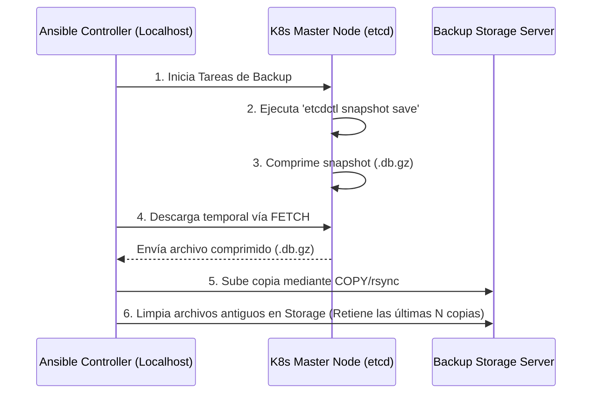

# Proyecto Ansible: Backup & Disaster Recovery de etcd para Kubernetes 🚀

Este proyecto implementa una arquitectura moderna, escalable y mantenible para la automatización de copias de seguridad consistentes de `etcd` (la base de datos y cerebro de tu clúster de Kubernetes) y provee un plan clínico y detallado para la recuperación ante desastres (DR).

---

## 🏛️ Arquitectura del Sistema

El flujo de copia de seguridad está diseñado para ser seguro y eficiente, utilizando **`rsync`** (encapsulado en Ansible) y ofreciendo dos topologías de red según la conectividad de tu infraestructura.

### Flujo de Backup (Modo Mediado por Controlador)
En este modo (por defecto), los nodos master y de almacenamiento no requieren conexión directa entre sí, ya que el orquestador de Ansible actúa como puente seguro.



---

## ⚙️ Configuración y Estructura

El proyecto sigue las mejores prácticas de Ansible. Los archivos principales son:

- **`ansible.cfg`**: Configura optimizaciones como SSH Pipelining activo y desactivación de Host Key Checking.
- **`inventories/production/hosts.yml`**: Define tus nodos master (`control_planes`) y servidores de backup (`backup_servers`).
- **`inventories/production/group_vars/all.yml`**: Centraliza todas las variables de configuración.

### Variables Principales (`group_vars/all.yml`)
- `etcd_transfer_mode`: `"controller_mediated"` (recomendado para redes segmentadas) o `"direct_rsync"`.
- `etcd_backup_server_retention_count`: Cantidad de copias de seguridad de etcd a retener en los servidores de backup por cada master (defecto: `3`).
  * *Nota: La retención de las últimas 3 copias en el origen (nodos master) la gestiona el motor interno de Kubernetes.*
- `etcd_backup_timer_calendar`: Programación en formato systemd timer (defecto: `"*-*-* 04:00:00"` - cada 4 horas).

---

## 🚀 Guía de Uso

### 1. Ejecución Manual del Backup
Para forzar una copia de seguridad inmediata en todos los servidores de la infraestructura:

```bash
ansible-playbook site.yml
```

### 2. Configurar la Automatización Periódica (Systemd Timer)
El playbook instala de forma nativa un temporizador de Systemd en los nodos maestros de K8s. Corre de forma persistente y escribe logs limpios en `journald`.
Para instalar/actualizar la programación periódica ejecutando solo esa sección del playbook:

```bash
ansible-playbook site.yml --tags backup_schedule
```

Para validar el estado de los temporizadores directamente en los nodos maestros:
```bash
systemctl status etcd-backup.timer
journalctl -u etcd-backup.service -f
```

---

## 🛡️ PLAN CLÍNICO DE RECUPERACIÓN ANTE DESASTRES (DR)

> [!WARNING]
> La restauración de `etcd` es una operación destructiva de alto riesgo. Detendrá temporalmente todo el plano de control del clúster de Kubernetes (`kube-apiserver`, `controller-manager`, `scheduler`). Ejecute estas acciones solo durante ventanas de mantenimiento o desastres declarados.

Ofrecemos dos alternativas para realizar la restauración: **Método Automatizado con Ansible** (Recomendado) y **Método Manual** (en caso de que la red o el orquestador estén caídos).

---

### Opción A: Restauración Automatizada (Recomendada) 🤖

El rol `etcd_restore` automatiza completamente la detención de servicios, la rotación segura de directorios corruptos, la restauración de datos mediante `rsync` y el reinicio del plano de control, reduciendo al mínimo el error humano. 

El sistema admite dos orígenes de backups (`etcd_restore_source`):
*   `backup_server` (Por defecto): Servidor de almacenamiento centralizado remoto.
*   `controller`: Directorio local en el host controlador de Ansible (por defecto en `backups/`).

Además, si no se provee un nombre de archivo, el playbook **identificará y restaurará automáticamente el snapshot más reciente** (`*.db.gz`).

#### Paso 1: Ejecutar el Playbook de Restauración

> [!NOTE]
> Para evitar desastres accidentales, el playbook siempre requerirá que confirmes la palabra **`CONFIRMAR`** de forma interactiva.

Elige una de las siguientes formas de ejecución según tus necesidades:

##### Caso 1: Restaurar el snapshot más reciente desde el Storage Remoto (Recomendado)
```bash
ansible-playbook restore.yml
```

##### Caso 2: Restaurar un snapshot específico desde el Storage Remoto
```bash
ansible-playbook restore.yml -e "etcd_restore_file_path=k8s-master-01-etcd-snapshot-20260601_120000.db.gz"
```

##### Caso 3: Restaurar el snapshot más reciente ubicado en el host de Ansible (directorio local `backups/`)
```bash
ansible-playbook restore.yml -e "etcd_restore_source=controller"
```

##### Caso 4: Restaurar un snapshot local específico pasándole la ruta absoluta o relativa
```bash
ansible-playbook restore.yml -e "etcd_restore_source=controller etcd_restore_file_path=/mi/ruta/custom-snapshot.db.gz"
```

---

#### ¿Qué hace el sistema de forma autónoma?
1. **Localiza y prepara el backup:** Encuentra el snapshot (el más nuevo o el especificado) en la fuente elegida (controlador o storage) y lo traslada vía **`rsync`** de manera segura al master.
2. **Aísla el plano de control:** Detiene temporalmente `kube-apiserver` y `etcd` moviendo los manifiestos de `/etc/kubernetes/manifests` para evitar corrupciones.
3. **Respaldo preventivo:** Renombra el directorio `/var/lib/etcd` corrupto a `/var/lib/etcd-old-TIMESTAMP` para permitir rollbacks.
4. **Bootstrap & Restore:** Ejecuta la restauración inyectando metadatos para inicializarlo como un miembro único sano.
5. **Permisos de seguridad:** Ajusta la propiedad a `root:root` y permisos a `700`.
6. **Reactivación:** Devuelve los manifiestos de Kubernetes y valida la salud del clúster (`kubectl get nodes`).

---

### Opción B: Restauración Clínica Manual 🛠️

En caso de que ocurra una caída masiva y debas restaurar directamente desde la consola SSH de un nodo maestro con un archivo de backup descargado manualmente, sigue esta secuencia quirúrgica:

#### Paso 1: Detener Kubelet y los Contenedores del Plano de Control
Accede por SSH al nodo maestro afectado como `root` y detén temporalmente la generación de pods estáticos:

```bash
# Crear directorio de respaldo temporal de manifiestos
mkdir -p /tmp/k8s-manifests-backup/

# Mover los manifiestos de etcd y la API fuera de la ruta de monitoreo de Kubelet
mv /etc/kubernetes/manifests/etcd.yaml /tmp/k8s-manifests-backup/
mv /etc/kubernetes/manifests/kube-apiserver.yaml /tmp/k8s-manifests-backup/

# Esperar a que docker/containerd detenga los contenedores
sleep 15
```

#### Paso 2: Respaldo del Directorio de Datos Afectado
**NUNCA elimines el directorio original de forma directa**. Mantén una copia por si requieres análisis forense:

```bash
# Mover la base de datos corrupta
mv /var/lib/etcd /var/lib/etcd-old-$(date +%s)
```

#### Paso 3: Descomprimir y Ejecutar el Restore
Si tu archivo está en formato `.gz`, descompímelo:

```bash
gunzip -c /var/lib/etcd-backups/etcd-snapshot-xxxxxx.db.gz > /tmp/etcd-restore.db
```

Ejecuta el restore inyectando las variables de red del nodo actual. Reemplaza `$(hostname)` e IPs según corresponda:

```bash
export ETCDCTL_API=3
etcdctl snapshot restore /tmp/etcd-restore.db \
  --name=$(hostname) \
  --data-dir=/var/lib/etcd \
  --initial-cluster="$(hostname)=https://127.0.0.1:2380" \
  --initial-advertise-peer-urls="https://127.0.0.1:2380"
```

#### Paso 4: Ajustar Permisos de Seguridad
Asegura que etcd (que se ejecuta como root dentro del pod estático en kubeadm) pueda leer los datos restaurados con el contexto de seguridad correcto:

```bash
chown -R root:root /var/lib/etcd
chmod -R 700 /var/lib/etcd
```

#### Paso 5: Reactivar el Plano de Control de Kubernetes
Regresa los manifiestos a su ubicación original para que `kubelet` los vuelva a instanciar de forma automática:

```bash
mv /tmp/k8s-manifests-backup/etcd.yaml /etc/kubernetes/manifests/
mv /tmp/k8s-manifests-backup/kube-apiserver.yaml /etc/kubernetes/manifests/

# Esperar arranque del clúster
sleep 20
```

#### Paso 6: Validar Salud y Estado de K8s
Monitorea que la API esté respondiendo y los componentes estén saludables:

```bash
kubectl get nodes
kubectl get pods -n kube-system -l component=etcd
kubectl get pods -n kube-system -l component=kube-apiserver
```

---

## 🛠️ Contribuciones y Desarrollo DevOps
Para el mantenimiento a largo plazo del equipo DevOps:
- Utiliza **Ansible Vault** para cifrar variables críticas de conexión si se despliega en producción real.
- Las adiciones de nuevas funcionalidades deben ser probadas previamente mediante validación de sintaxis:
  ```bash
  ansible-playbook site.yml --syntax-check
  ```
